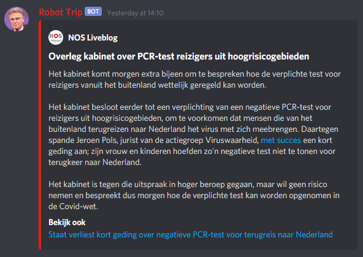
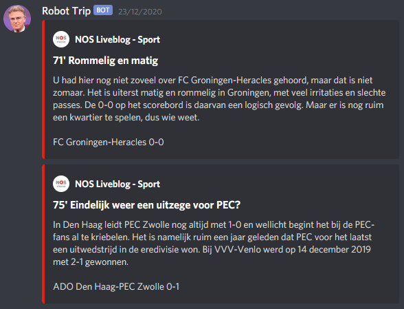

# Robot Trip

A Discord bot for posting NOS Liveblog posts in Discord.

This bot is hosted on a [Discord server](https://discord.gg/b5adKRGQ3w) where you are able to subscribe to the channels to send the bot's messages to a channel in your own server. Leaving the server after doing so will not remove the subscription.

[Join the server](https://discord.gg/b5adKRGQ3w)

## Examples





## Hosting the bot

1. Install [Node.js](https://nodejs.org/en/)
2. Open a terminal and navigate to the `code`folder
3. Run `npm install` to install all the dependencies.
4. Run `npm run-script build`
5. Make sure you have an `.env` file in your `code`directory. See example file below.
6. Run `npm run-script start`

### Example .env file

```bash
TOKEN=[Discord bot token]

CHANNEL_NEWS_ID=[Channel where to post news liveblogs]

CHANNEL_SPORTS_ID=[Channel where to post sports liveblogs]
```

